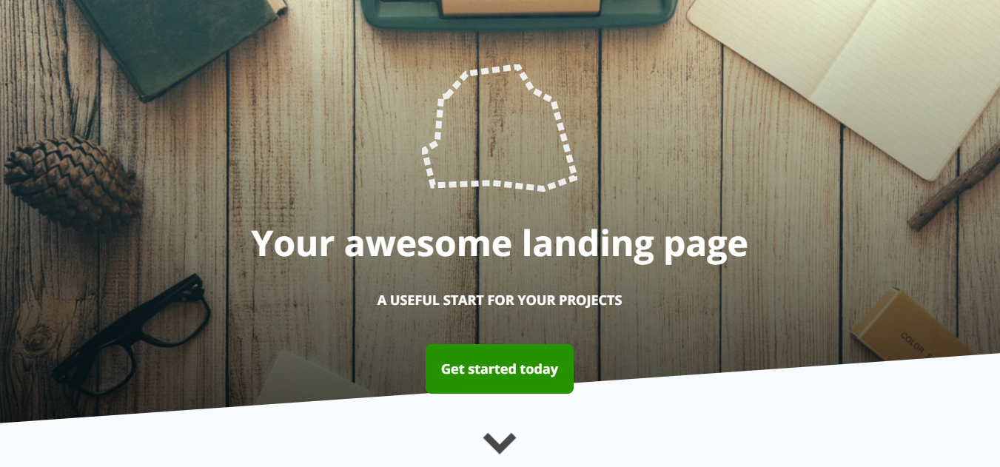

# CSS Animation - Build An Animated Hero Header

This CSS Animation project, we will build an animated hero header. The first thing is to detect page has finished loaded before applying animations. Once page has loaded, background image will slowly fade in from top followed by header logo, title, subtitle and button fading in. The wedge at bottom will also fade in from bottom. Finally scroll-down-arrow will fade in from bottom at first and then start pulsing infinitely.

[View demo site here.](http://edwinchen.co/css_animation_animated_hero_header/)

